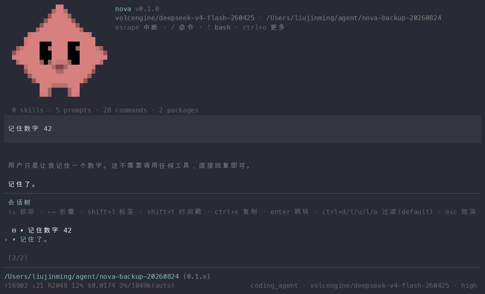

# 会话与分支

## 会话存储

会话以 JSONL 明文存于 `~/.nova/agent/sessions/--<cwd>--/`（每个工作目录一个目录）。每条记录是一个"条目"（entry）：消息、模型切换、压缩、分支摘要、标签、自定义条目等。条目带 `parent_id`——**会话天然是树**，不是线性日志。

## 树操作三件套

- **fork（分叉）**：从某个条目岔出新分支——原条目之前的历史保留，之后重走。`/fork` 弹消息选择器，或 `/fork <entry_id> [at|before|after]` 精确指定；
- **tree（树导航）**：`/tree` 弹树选择器查看全部分支（含每个分支的最新动态），选中即跳转；
- **navigate（分支间跳跃）**：跳转到树中任意节点——跳到有子分支的节点时可选择沿哪条分支继续；带摘要的跳转会在目标分支生成"分支摘要"条目，让模型知道自己是从别的分支跳来的。

fork 与 navigate 的区别：fork **创建**新分支（当前位置分叉），navigate **移动**到已有节点。

## 会话管理

- `/new` 新会话；`/resume` 选择器恢复历史会话（按修改时间排序，支持搜索）；
- `/clone` 克隆当前会话（内容复制到新会话文件）；
- `/name` 命名（选择器与列表里显示）；
- `/export` 导出（HTML 给人看，JSONL 给机器/备份）；`/import` 导入 JSONL。

## 上下文压缩（compaction）

上下文逼近模型窗口时自动压缩（auto），或 `/compact` 手动触发：用 LLM 生成结构化摘要替换早期历史（保留最近若干 token + 摘要 + 文件操作清单）。footer 的 `42%/262k(auto)` 即当前占用与策略。

- 压缩点也是树条目——压缩前的历史仍在文件里，可经 tree 回溯；
- 压缩失败/取消不会损坏会话（条目未写入即无效果）；
- 触发水位与保留量在 settings 的 `compaction` 段调整。

## 分支安全的设计

工具状态（todo 清单、plan 进度、面板开关、subagent 授权）以**条目**形式写在会话里，分支切换/恢复时重放——每条分支有自己独立一致的工具状态，互不污染。

## 崩溃与恢复

每条追加即时落盘（JSONL append），进程被杀最多丢当轮未完成的输入。重启后 `/resume` 回到任何会话的任何分支。
