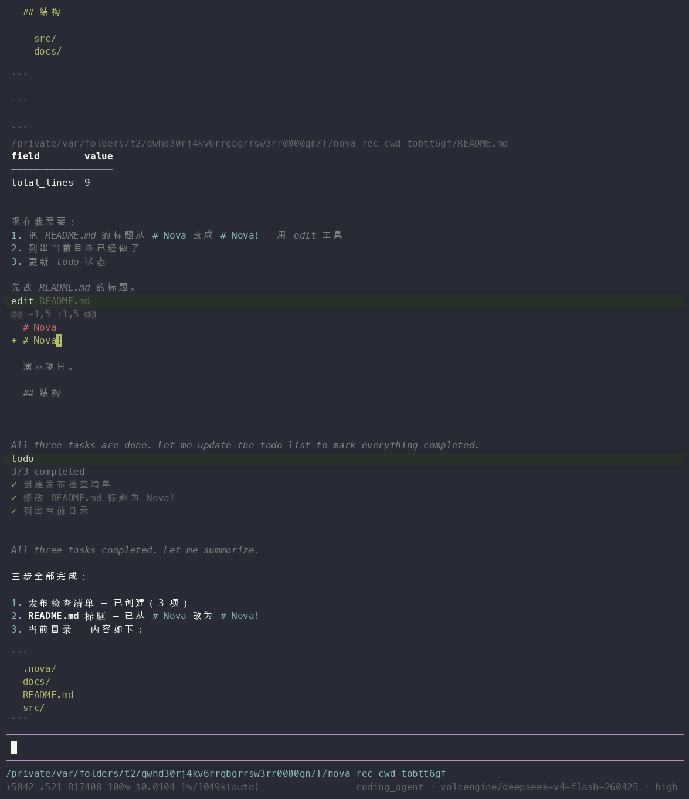
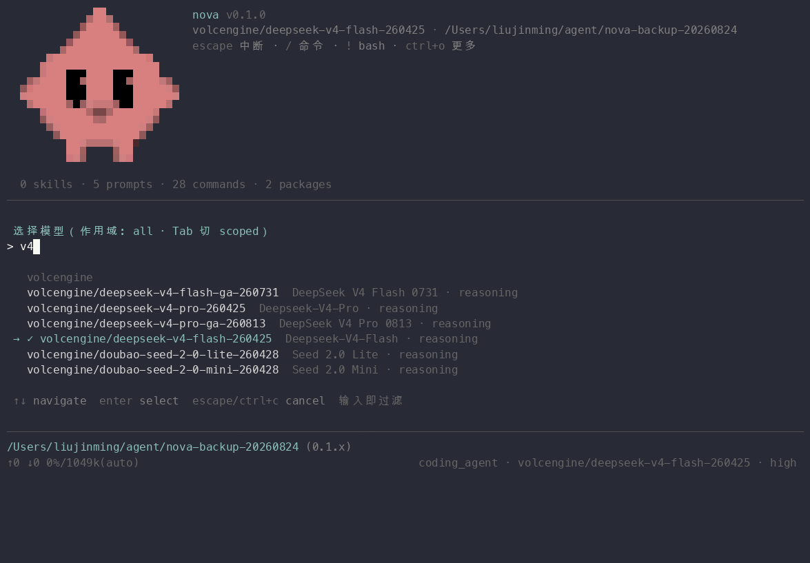
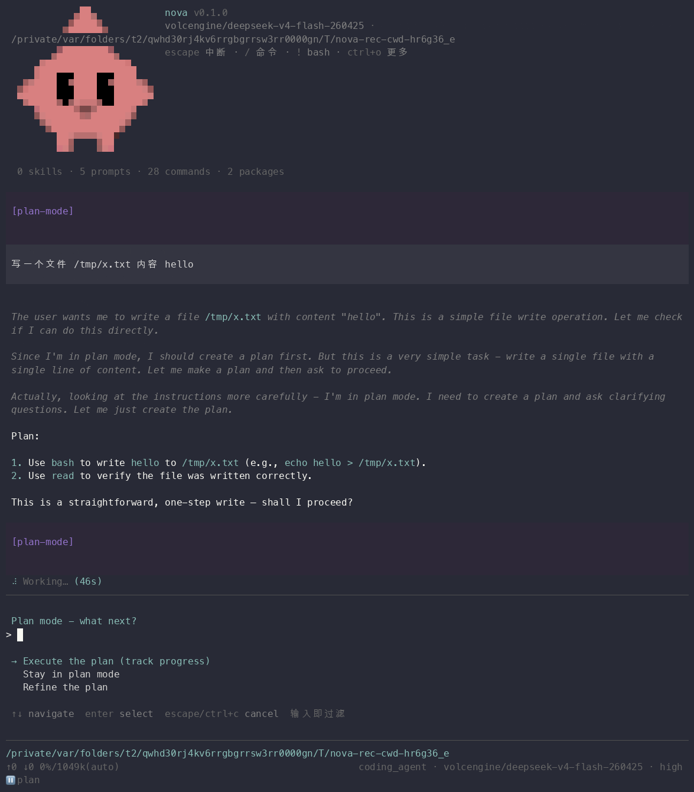
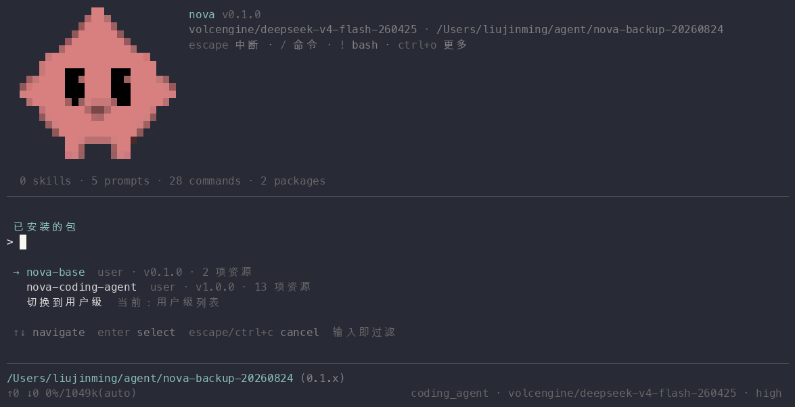

# TUI 界面

`nova` 启动后进入 TUI（终端用户界面）。整体构成：顶部欢迎/资源区 → 中间转录区（消息与工具卡片）→ 底部状态区（loader/工作区）→ 输入框 → footer。

## 界面一览

**启动与一轮真实工具调用对话**：

**子代理并行执行**（gate 确认 → 两 worker 并行 → 用量行收尾）：

**工具卡片**：edit 的词级 diff、todo 清单、ls 网格——执行计时归宿主统一行：

**选择器**：`/model` 模糊搜索中态（当前模型 ✓ 置顶）：

**plan 模式**：只读规划——写操作被拦并给出解释，footer 显示 `⏸ plan`：

**包面板**：`/packages`——已装包、作用域、版本与资源计数：

## 键位

| 键 | 作用 |
|----|------|
| `Esc` | 中断当前生成；对话框/面板中关闭浮层（域级路由——先关浮层，再中断生成） |
| `Ctrl+C` 双击 | 退出 |
| `Ctrl+D`（空输入时） | 退出 |
| `Ctrl+O` | 展开/收起工具卡片详情（全部卡片） |
| `Ctrl+P` | 循环 scoped 模型池的启用集与顺序 |
| `Ctrl+Alt+P` | 切换 plan 模式（需 `nova-coding-agent`） |
| `Tab` | 命令/参数自动补全 |
| `↑` | 编辑器历史/选择器上移 |

键位可用 `~/.nova/agent/frontend/tui/keybindings.json` 自定义（三级合并：包注册 → 用户表 → 项目表）。

## 转录区

- **assistant 消息**：Markdown 渲染，链接可点（OSC 8——支持的终端里 `cmd/ctrl+点击`）；
- **工具卡片**：每个工具一个卡片——标题（工具名 + 状态），内容区是该工具"在跑什么"（bash 的命令、edit 的 diff、grep 的模式……），执行时间归宿主统一计时行；
- **thinking 块**：折叠显示（`Thought for 3s` 式摘要），可展开；
- **todo 清单卡片**：`/todos` 之外，todo 工具每次更新也在转录留卡片。

## 状态区（输入框上方）

工作时的实时仪表：当前动作文案（working/retry 倒计时/压缩原因）+ 取消提示 + 任务耗时与 token 消耗。todo 清单非空时同步显示进度概览——"在干什么、打算干什么、干了多久、花了多少"一区看齐。

## footer

`角色 · persona · 模型 · thinking 级别` + 扩展状态行（如 plan 模式的 `⏸ plan` / `📋 n/m` 进度）。包可经 `set_status` 原语挂自己的状态段。

## 面板与对话框

- `/settings`：18 项设置面板（重试/压缩/终端/图片等，改了就持久化）；
- `/packages`：包面板——详情、更新、卸载（`nova-base` 不提供卸载动作）；
- `/theme`：主题列表实时预览（上下移动即换肤，确认落地）；
- 选择器统一支持模糊搜索（输入即过滤）、per-item 动作键（如会话选择器里的删除）。

## 主题

内建 dark/light；用户主题放 `~/.nova/agent/frontend/tui/themes/*.json`（theme-json 契约），包也可经 `frontend/themes/` 分发主题。`settings.json` 的 `theme` 键持久化选择。

## 终端集成

- 终端选项卡标题显示 `nova`（OSC 0）；
- 任务进度进入支持 OSC 9;4 的终端（进度条）；
- turn 结束发桌面通知（OSC 9/777/99，终端支持时）。

## 首启引导与 What's New

- 无可用鉴权时启动即弹登录引导；
- 版本升级后首次启动显示 What's New（changelog 摘要，`/changelog` 随时重看）。
